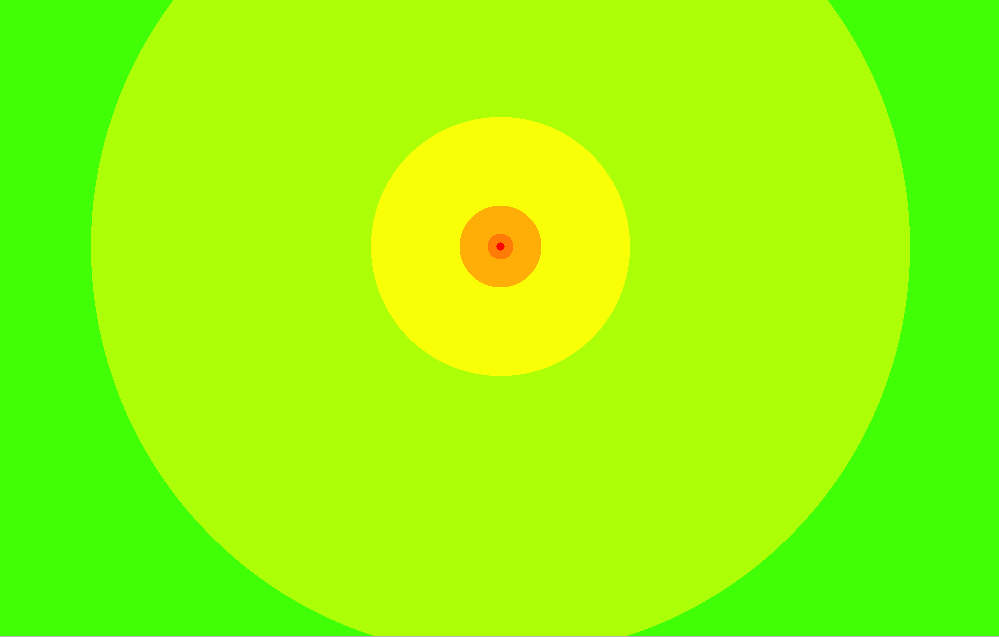
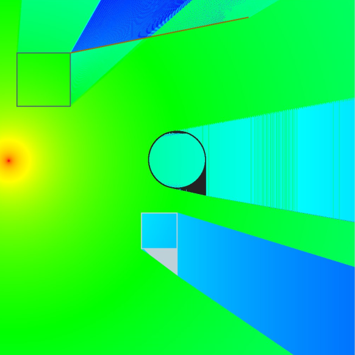

# Реализация тепловой карты
## Лабораторная 1

- Добавлены цвета для спектра

## Лабораторная 2

Добавлены:
- градиент
- препятствия
- затухание сигнала

## Лабораторная 3

- Произведен рефакторинг
